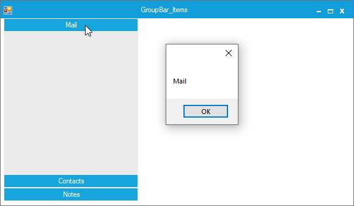

# How to Get Selected Visible GroupBarItem in WinForms GroupBar
This example demonstrates how to retrieve the selected visible GroupBarItem in the Syncfusion WinForms GroupBar control. The GroupBar control organizes content into collapsible groups, providing a clean and structured interface for applications. In certain scenarios, you may need to determine which visible item is currently selected—such as when implementing dynamic layouts, saving user preferences, or performing conditional operations based on visibility.

## Why This Is Useful
- Dynamic UI Updates: Perform actions based on the selected visible item.
- User Preferences: Save and restore selected items for better UX.
- Conditional Logic: Trigger specific functionality only for visible groups.


## Key Approach
- Use the VisibleGroupBarItems property to access the collection of visible items.
- Use the SelectedItem property to get the index of the currently selected item.
- Combine both to retrieve the selected visible item’s details.

## Example Code
```C#
public partial class Form1 : MetroForm
{
    GroupBar groupBar1 = new GroupBar();

    public Form1()
    {
        InitializeComponent();

        groupBar1.Size = new Size(220, 300);
        groupBar1.VisualStyle = VisualStyle.Metro;
        groupBar1.BackColor = Color.FromArgb(235, 235, 235);

        groupBar1.GroupBarItemSelected += GroupBar1_GroupBarItemSelected;

        // Create GroupBar items
        GroupBarItem groupBarItem1 = new GroupBarItem() { Text = "Mail" };
        GroupBarItem groupBarItem2 = new GroupBarItem() { Text = "Contacts" };
        GroupBarItem groupBarItem3 = new GroupBarItem() { Text = "Tasks", Visible = false };
        GroupBarItem groupBarItem4 = new GroupBarItem() { Text = "Notes" };

        groupBar1.GroupBarItems.AddRange(new GroupBarItem[] { groupBarItem1, groupBarItem2, groupBarItem3, groupBarItem4 });

        this.Controls.Add(groupBar1);
    }

    private void GroupBar1_GroupBarItemSelected(object sender, EventArgs e)
    {
        // Get the selected visible GroupBarItem
        string selectedVisibleItem = groupBar1.VisibleGroupBarItems[groupBar1.SelectedItem].Text;
        MessageBox.Show(selectedVisibleItem);
    }
}
```

## Output

